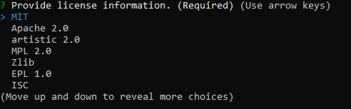
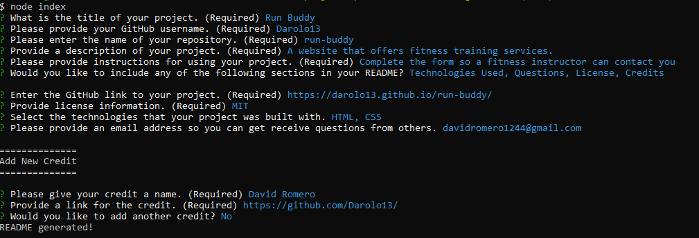
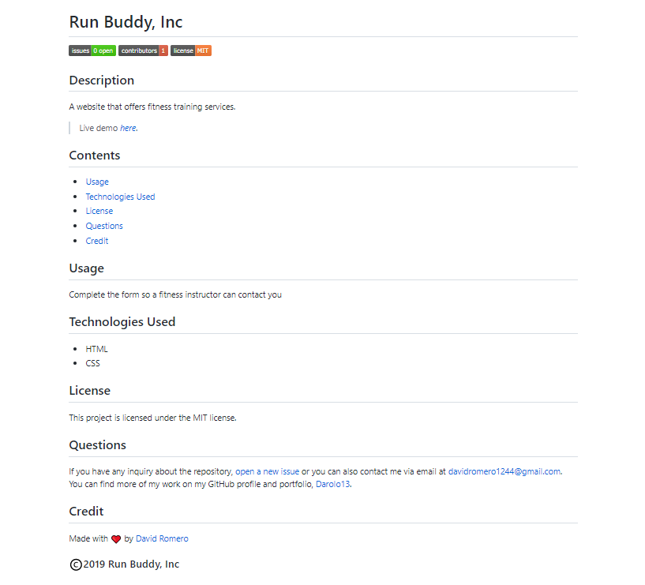

# _Professional README Generator_
> A simple app that lets you create great READMEs with only a series of steps in the command line.

## Table of Contents
* [Technologies Used](#technologies-used)
* [Features](#features)
* [Screenshot](#screenshot)
* [Project Status](#project-status)
* [Room for Improvement](#room-for-improvement)

## Technologies Used
- Tech 1 - JavaScript
- Tech 2 - Node.js

- Node Module: **Inquirer**

## Features
Ready Features:
1. **Generate README**
- Allows to create a README file within seconds.
2. **Allow the user to select a specific license**

3. **Allows to generate badges for a better README**

## Installation
To use this project, Please install:

`npm install inquirer`

## Screenshot
### professional-README-generator:

## Project Status
Project is: _in progress_

## Room for Improvement
Room for improvement:
- TBD

To do:
- Add a GUI
- Add local Storage so the README files can be stored
